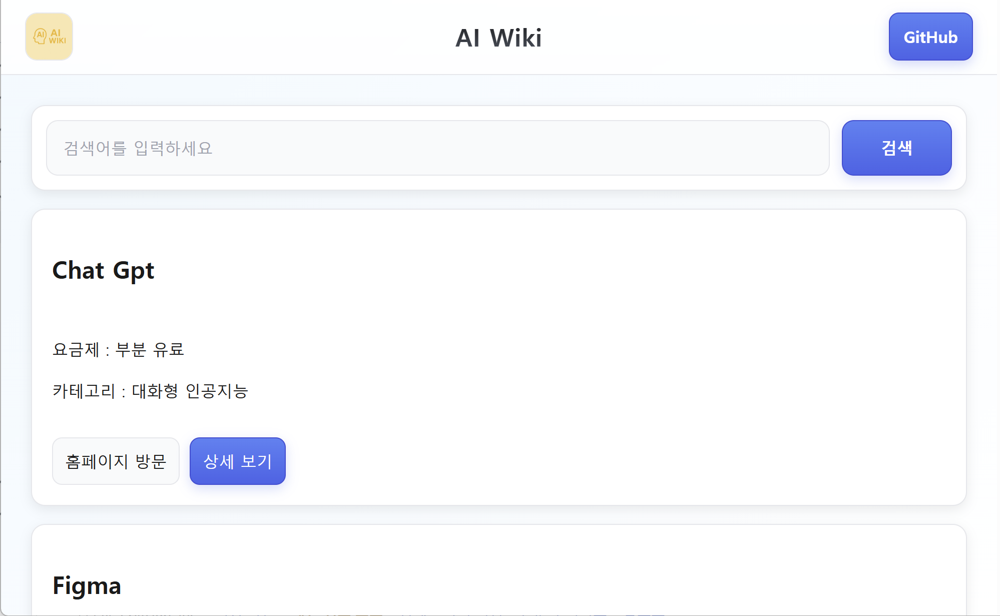
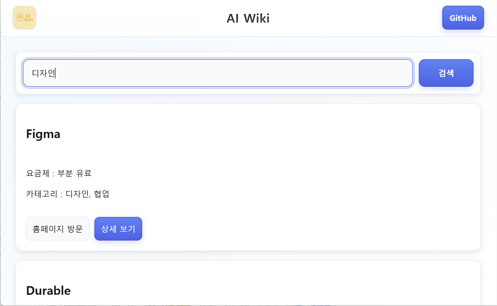
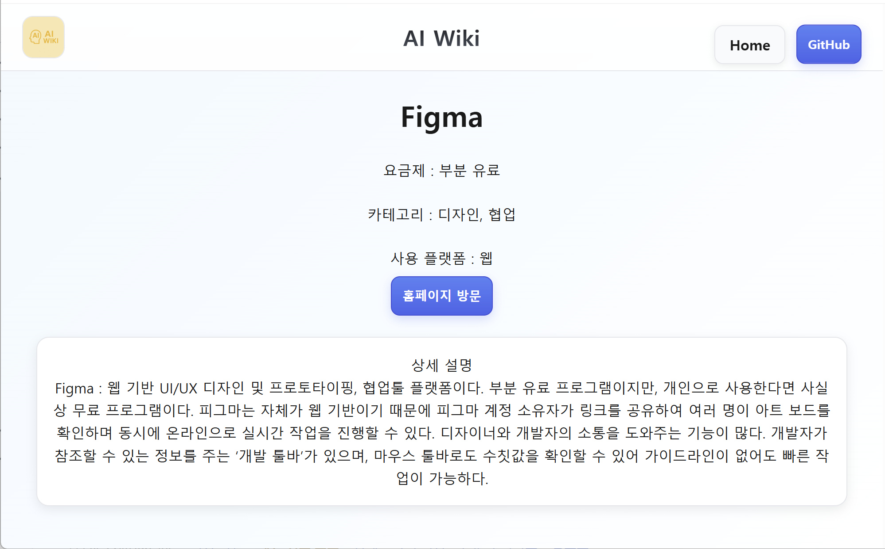

# AI Wiki

> **AI 도구를 한 곳에서 탐색할 수 있도록 정리한 프론트엔드 프로젝트입니다.**

- Demo: [visit](https://www.aiwiki.kr)
- Note: [visit](https://www.notion.so/2025-266a7b218ece80e49d6ae8c25ef883ee?source=copy_link)

<br>

## 📝프로젝트 개요

- 목적: AI 툴들이 너무 많아 찾기 힘들다는 불편을 해결하기 위해 AI 백과사전 웹사이트를 제작해보았습니다.
- 대상 사용자: AI 툴을 찾으려는 사용자

<br>

## 💡주요 기능

- AI 툴 리스트 조회
- 키워드 검색
- 툴 상세 페이지(설명/링크/가격/플랫폼 등)

<br>

**home 화면**


<br>

**검색 결과**


<br>

**detail 페이지**


<br>

## 🛠️기술 스택 (skills & tools)

- Frontend: React
- Build Tooling: Vite
- Language: JavaScript / HTML / CSS
- Package Manager: npm

<br>

## 💻요구사항 (Prerequisites)

- Node.js
- npm

<br>

## ⚙️로컬 실행 방법 (How to run)

**1) 레포 클론**
```
git clone https://github.com/SUN-AAA/aiwiki.git
cd aiwiki
```
**2) 의존성 설치**
```
npm install
```

**3) 개발 서버 실행**
```
npm run dev
```
